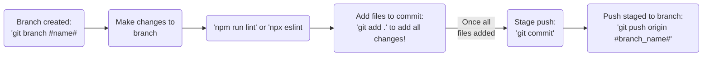

# Node.js Scripts for Customer Success Engineers

## Description
Welcome to the sharingan repository. These scripts are designed to help Customer Success Engineers interact with the SafetyCulture API, either for internal support or customers. Whether you're new to the team or looking to refine your skills, this repository offers valuable resources to get you started with automating.

This repository will mostly utilize nodeJS (because we are raised by web developers), but feel free to utilize programming langagues you are comfortable in. In those cases, please consider limitations that may be present when someone wishes to utilize your scripts (virtual environments, etc.) and provide exceptional documentation.

## Table of Contents
- [Getting Started](#getting-started)
- [Prerequisites](#prerequisites)
- [Clone the Repo!](#clone-the-repo!)
- [Usage](#usage)
- [Contributing](#contributing)
- [Support](#support)

## Getting Started
To get started, follow the instructions below to set up your environment.

## Prerequisites
Make sure you have the following installed:
- [Node.js](https://nodejs.org/) (version 20 or higher)
- [npm](https://www.npmjs.com/) (Node Package Manager)
- Access to the SafetyCulture API (Bearer token for customer)

## Clone the Repo!
Navigate to the desired path on your local machine and clone the repository:
   ```bash
   git clone https://github.com/roronoaBoi/sharingan.git
   ```

## Usage
Each script in this repository serves a specific purpose. Refer to the scripts README on how to use the script.

## Contributing
We welcome contributions from the team! If you have a new script or an enhancement to an existing one, please follow these steps:


<3

## Support
Email amer.cse@safetyculture.io if instructions are not clear or incorrect.

"I'll give to you... this Sharingan of mine."
<p align="center">

</p>